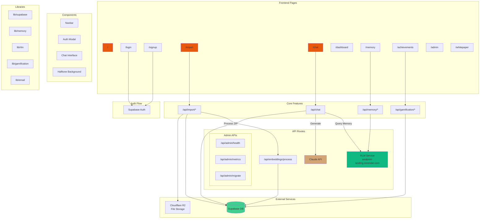
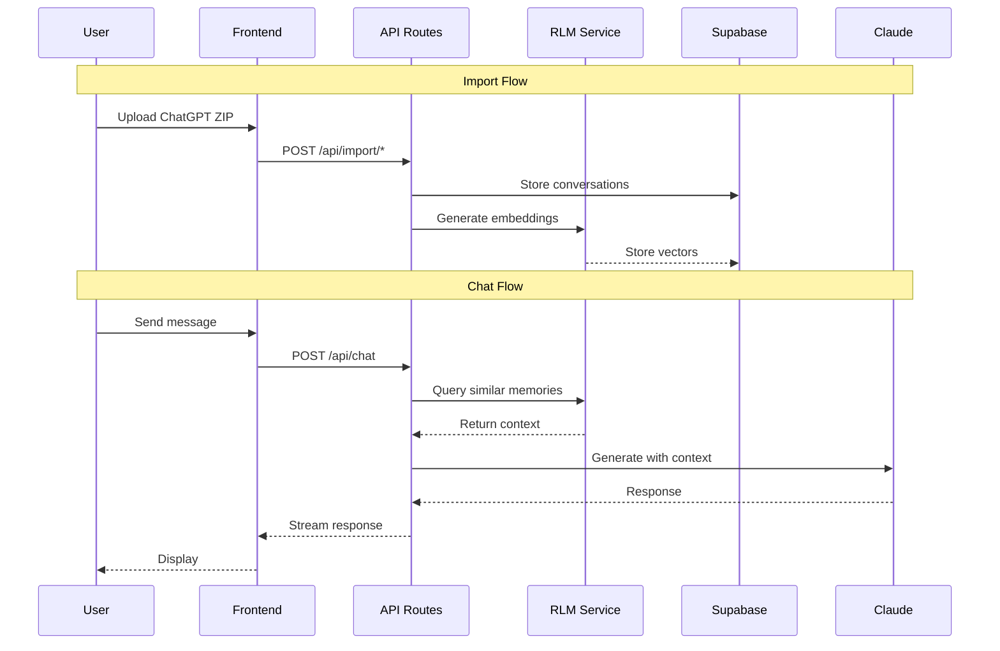

# SoulPrint Landing - Architecture Diagram

## Data Flow

## Key Directories

| Path | Purpose |
|------|---------|
| `/app` | Next.js app router pages & API routes |
| `/components` | React components (chat, auth, UI) |
| `/lib` | Business logic (supabase, memory, gamification) |
| `/supabase` | Database migrations & config |
| `/rlm-service` | Memory/embedding service code |
| `/public` | Static assets |

## External Dependencies

| Service | Purpose | URL |
|---------|---------|-----|
| Supabase | Auth + Database | swvljsixpvvcirjmflze.supabase.co |
| RLM Service | Memory embeddings | soulprint-landing.onrender.com |
| Claude API | AI responses | api.anthropic.com |
| Cloudflare R2 | File storage | - |
| Vercel | Hosting | soulprintengine.ai |
