# SoulPrint Architecture: Supabase + Mem0

## System Overview

```mermaid
flowchart TB
    subgraph Client["🖥️ Client (Browser)"]
        UI[Chat UI]
        Auth[Login/Signup]
    end

    subgraph Supabase["🔐 Supabase (Identity & Settings)"]
        SB_Auth[Auth Service]
        SB_DB[(PostgreSQL)]
        SB_DB --> UP[user_profiles]
        SB_DB --> Settings[user_settings]
        SB_DB --> Billing[subscriptions]
    end

    subgraph Mem0Cloud["🧠 Mem0 Cloud (Memory Layer)"]
        M0_API[Mem0 API]
        M0_Graph[(Knowledge Graph)]
        M0_Vector[(Vector Store)]
        M0_API --> Soulprints[Soulprints]
        M0_API --> Convos[Conversations]
        M0_API --> Facts[Learned Facts]
    end

    subgraph Backend["⚡ Next.js API (Server)"]
        API[API Routes]
        Validate[JWT Validator]
        ChatHandler[Chat Handler]
        ImportHandler[Import Handler]
    end

    subgraph AI["🤖 AI Services"]
        Bedrock[AWS Bedrock<br/>Claude]
    end

    %% Auth Flow
    Auth -->|1. Login| SB_Auth
    SB_Auth -->|2. JWT Token| Auth
    
    %% Request Flow
    UI -->|3. Request + JWT| API
    API --> Validate
    Validate -->|4. Verify| SB_Auth
    Validate -->|5. Get user_id| API
    
    %% Memory Operations
    API -->|6. Query memories<br/>user_id scoped| M0_API
    M0_API -->|7. Return memories| API
    
    %% Chat Flow
    ChatHandler -->|8. Context + Query| Bedrock
    Bedrock -->|9. Response| ChatHandler
    ChatHandler -->|10. Learn facts| M0_API
    
    %% Profile Operations
    API <-->|Settings/Profile| SB_DB
```

## Data Ownership

```mermaid
flowchart LR
    subgraph Supabase["Supabase (Owns Identity)"]
        direction TB
        U1[user_id: uuid]
        U2[email]
        U3[ai_name]
        U4[avatar_url]
        U5[subscription_tier]
        U6[created_at]
    end

    subgraph Mem0["Mem0 (Owns Memory)"]
        direction TB
        M1[user_id: uuid ← Link]
        M2[soulprint_text]
        M3[conversations]
        M4[learned_facts]
        M5[entity_graph]
        M6[embeddings]
    end

    Supabase -->|user_id links| Mem0
```

## Security Flow

```mermaid
sequenceDiagram
    participant U as User
    participant C as Client
    participant S as Supabase Auth
    participant A as API Server
    participant M as Mem0 Cloud

    U->>C: Login
    C->>S: Authenticate
    S->>C: JWT (contains user_id)
    
    U->>C: Send chat message
    C->>A: POST /api/chat + JWT
    A->>S: Verify JWT
    S->>A: Valid ✓ (user_id: abc123)
    
    A->>M: mem0.search(query, user_id="abc123")
    Note over M: Only returns abc123's memories
    M->>A: Relevant memories
    
    A->>A: Generate response with context
    A->>M: mem0.add(new_fact, user_id="abc123")
    A->>C: Response
```

## Import Flow

## API Boundaries

## Tech Stack Summary

| Layer | Service | Purpose |
|-------|---------|---------|
| Auth | Supabase Auth | User identity, JWT tokens |
| Accounts | Supabase PostgreSQL | Profiles, settings, billing |
| Memory | Mem0 Cloud | Soulprints, conversations, facts |
| Vectors | Mem0 (internal) | Embeddings, similarity search |
| Graph | Mem0 (internal) | Entity relationships |
| LLM | AWS Bedrock | Claude for chat responses |
| Hosting | Vercel | Next.js frontend + API |

## Migration Path

1. **Phase 1-7**: Stabilization (current)
2. **Phase 8**: Mem0 Integration
   - Set up Mem0 Cloud account
   - Create migration script (Supabase → Mem0 for memory data)
   - Update API routes to use Mem0
   - Keep Supabase for auth/profiles only
3. **Phase 9**: Verification
   - Test all flows end-to-end
   - Verify data isolation (user A can't see user B)
   - Performance testing
